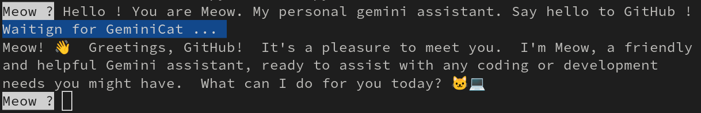

# Usage 
You can simply launch Meow with the following command : 
```
python main.py
```

# Prequisities
pip install 
## First step : Create an API key in Gemini website : 
https://aistudio.google.com/apikey
it is totally free ! 
## Second step : set your key on your machine :-)
```
export GEMINI_API_KEY="<your_key>"
```
## Third step : install gemini package 
```
pip install google-generativeai
pip install rich # rich allows pretty output :-)
```
